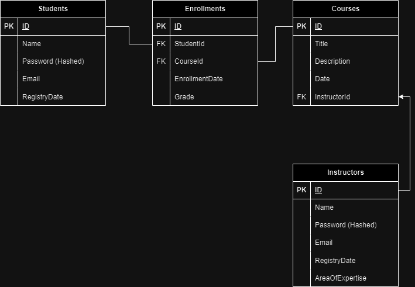
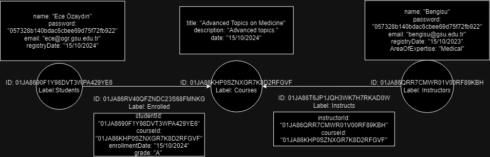

# HW1 Online Course Platform

## Introduction
This is a simple online course platform that allows students to view courses, enroll in courses, and view their 
enrolled courses. The platform is implemented using Golang, PostgreSQL and will be implementing Neo4j and built-in graph.

## Features
- View all courses
- Enroll in a course
- View enrolled courses
- View course details
- View course grades
- Add instructors
- Add students
- Add courses

## Installation
1. Clone the repository
2. Run `go mod tidy` to install dependencies
3. Install Docker
4. Run `docker-compose up` to start the PostgreSQL and Neo4j databases (You need to configure which database you want to use in config.yaml file by making its active field true)
5. Run `go run main.go` to start the server
6. The server will be running on `localhost:4040` which can be changed in the config.yaml file
7. You can now access the API using Postman or any other API testing tool

## API Endpoints
- GET `/courses` - Get all courses
- POST `/courses` - Add a course
- GET `/courses/{id}` - Get a course by ID
- PUT `/courses/{id}` - Update a course by ID
- DELETE `/courses/{id}` - Delete a course by ID
- GET `/students` - Get all students
- POST `/students` - Add a student
- GET `/students/{id}` - Get a student by ID
- PUT `/students/{id}` - Update a student by ID
- DELETE `/students/{id}` - Delete a student by ID
- GET `/instructors` - Get all instructors
- POST `/instructors` - Add an instructor
- GET `/instructors/{id}` - Get an instructor by ID
- PUT `/instructors/{id}` - Update an instructor by ID
- DELETE `/instructors/{id}` - Delete an instructor by ID
- GET `/enrollments` - Get all enrollments
- POST `/enrollments` - Add an enrollment
- GET `/enrollments/{id}` - Get an enrollment by ID
- PUT `/enrollments/{id}` - Update an enrollment by ID
- DELETE `/enrollments/{id}` - Delete an enrollment by ID
- GET `/enrollments/student/{studentId}/course/{courseId}` - Get an enrollment by student ID and course ID

Also can be found in the Postman collection in the CoursePlatform.postman_collection.json file

## Database Schema
The database schema is as follows:
- Courses
  - ID
  - Name
  - Description
  - InstructorID
- Students
- Instructors
- Enrollments
  - ID
  - StudentID
  - CourseID
  - Grade

The relational model is as follows:

## Graph Database Schema
The graph database schema is as follows:
